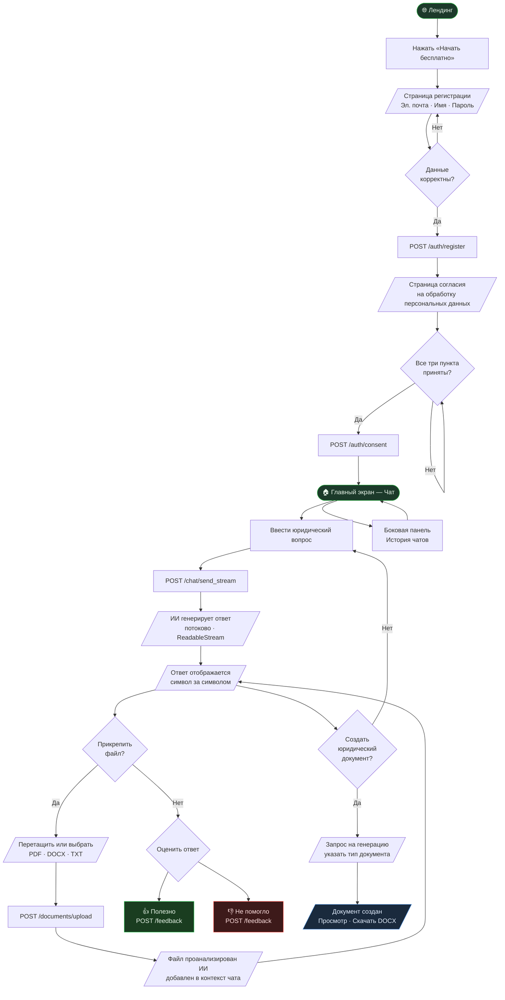
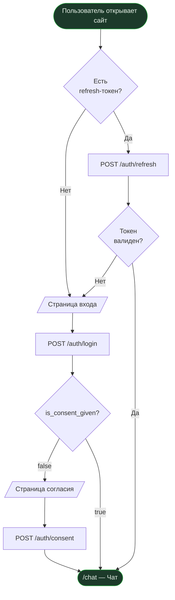
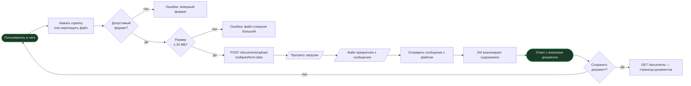
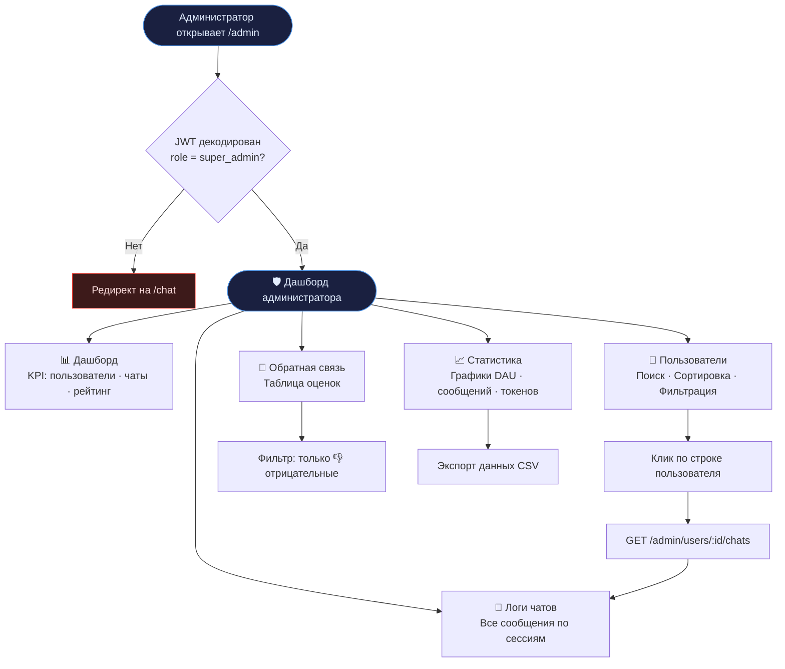

# ИИ-Юрист — Фронтенд приложения

> Веб-интерфейс платформы юридических консультаций на базе ИИ.  


---

## Содержание

1. [Обзор платформы](#1-обзор-платформы)
2. [Путь пользователя](#2-путь-пользователя)
3. [Архитектура фронтенда](#3-архитектура-фронтенда)
4. [Структура директорий](#4-структура-директорий)
5. [Технический стек](#5-технический-стек)
6. [Установка и запуск](#6-установка-и-запуск)
7. [Переменные окружения](#7-переменные-окружения)
8. [API-интеграция](#8-api-интеграция)
9. [Управление состоянием](#9-управление-состоянием)
10. [Маршруты приложения](#10-маршруты-приложения)
11. [Безопасность](#11-безопасность)
12. [Панель администратора](#12-панель-администратора)

---

## 1. Обзор платформы

**ИИ-Юрист** — SaaS-платформа юридических консультаций с чат-интерфейсом на базе LLM. Пользователи задают юридические вопросы, загружают документы, получают квалифицированные ответы в режиме реального времени с потоковым выводом текста.

### Ключевые возможности

| Функция | Описание |
|---|---|
| 💬 Чат с ИИ | Диалог в реальном времени с потоковыми ответами (SSE) |
| 📂 Загрузка файлов | PDF, DOCX, TXT — анализируются и добавляются в контекст |
| 📄 Документы | Генерация и хранение юридических документов |
| 👍 Обратная связь | Оценка каждого ответа: полезно / не помогло |
| 🛡 Администрирование | Панель управления для аудита, логов и статистики |
| 🔐 Авторизация | JWT (access 15 мин + refresh 7 дней), согласие на ПДн |

---

## 2. Путь пользователя

### 2.1 Основной пользовательский поток



### 2.2 Первый вход (повторная авторизация)



### 2.3 Загрузка файла и работа с документом



### 2.4 Панель администратора



---

## 3. Архитектура фронтенда

```mermaid
graph TB
    subgraph Browser["🌐 Браузер"]
        Router[React Router v6\nSPA-навигация]
        Router --> PublicPages[Публичные страницы\nLanding · Login · Register]
        Router --> ProtectedPages[Защищённые страницы\nChat · Documents]
        Router --> AdminPages[Страницы администратора\n/admin/*]

        subgraph State["Состояние (Zustand)"]
            AuthStore[authStore\nuser · tokens · consent]
            ChatStore[chatStore\nmessages · activeChat · streaming]
            UIStore[uiStore\nsidebar · toasts]
        end

        subgraph API["API-слой"]
            AxiosClient[Axios-клиент\nJWT interceptors · auto-refresh]
            QueryCache[TanStack Query\nКэш · повторные запросы]
            SSEStream[fetch + ReadableStream\nСтриминг LLM-ответов]
        end

        subgraph Components["Компоненты"]
            PlasmaUI[Plasma B2C\nUI-компоненты]
            ChatUI[ChatWindow\nMessageBubble · Input · SSE]
            AdminUI[AdminPanel\nTables · Charts · Logs]
        end
    end

    subgraph Backend["⚙️ Backend (FastAPI)"]
        AuthAPI[/auth/*]
        ChatAPI[/chat/*]
        DocsAPI[/documents/*]
        AdminAPI[/admin/*]
        FeedbackAPI[/feedback]
    end

    AxiosClient --> AuthAPI
    AxiosClient --> ChatAPI
    AxiosClient --> DocsAPI
    AxiosClient --> AdminAPI
    AxiosClient --> FeedbackAPI
    SSEStream --> ChatAPI

    style Browser fill:#0C0C0E,color:#FFFFFF,stroke:#21A038
    style Backend fill:#0C1A10,color:#FFFFFF,stroke:#21A038
    style State fill:#161618,color:#FFFFFF,stroke:#333
    style API fill:#161618,color:#FFFFFF,stroke:#333
    style Components fill:#161618,color:#FFFFFF,stroke:#333
```

---

## 4. Структура директорий

```
frontend/
├── public/
│   ├── favicon.ico
│   └── robots.txt
├── src/
│   ├── api/
│   │   ├── client.ts          # Axios + JWT interceptors + auto-refresh
│   │   ├── auth.ts            # register, login, logout, refreshToken
│   │   ├── chat.ts            # createChat, getChats, sendStream, getHistory
│   │   ├── documents.ts       # uploadFile, listDocuments, getDocument
│   │   ├── feedback.ts        # submitRating (message_id, rating)
│   │   └── admin.ts           # users, chats, feedback, stats
│   ├── assets/
│   │   └── logo.svg
│   ├── components/
│   │   ├── layout/
│   │   │   ├── AppLayout.tsx      # Оболочка для авторизованных страниц
│   │   │   ├── AuthLayout.tsx     # Центрированная карточка для форм авторизации
│   │   │   ├── Sidebar.tsx        # Левая панель: история чатов, кнопка «Новый чат»
│   │   │   └── Header.tsx         # Верхняя панель: логотип, меню пользователя
│   │   ├── chat/
│   │   │   ├── ChatWindow.tsx         # Список сообщений
│   │   │   ├── MessageBubble.tsx      # Пузырёк сообщения (user/assistant)
│   │   │   ├── MessageInput.tsx       # Поле ввода + кнопка отправки + прикрепление
│   │   │   ├── StreamingMessage.tsx   # Анимация печатания при стриминге
│   │   │   ├── FeedbackButtons.tsx    # 👍 👎 под каждым ответом ассистента
│   │   │   └── FileAttachment.tsx     # Зона перетаскивания файлов
│   │   ├── documents/
│   │   │   ├── DocumentCard.tsx       # Карточка документа в списке
│   │   │   └── DocumentViewer.tsx     # Просмотр документа
│   │   ├── admin/
│   │   │   ├── UserTable.tsx          # Таблица пользователей
│   │   │   ├── ChatLogViewer.tsx      # Просмотр логов чата
│   │   │   ├── FeedbackTable.tsx      # Таблица оценок
│   │   │   └── StatsChart.tsx         # Графики статистики (Recharts)
│   │   └── common/
│   │       ├── ProtectedRoute.tsx     # Редирект на /login если не авторизован
│   │       └── AdminRoute.tsx         # Редирект на /chat если не super_admin
│   ├── hooks/
│   │   ├── useAuth.ts                 # Авторизация, выход, refresh
│   │   ├── useChat.ts                 # Создание и загрузка чатов
│   │   ├── useSSE.ts                  # fetch + ReadableStream для стриминга
│   │   └── useFileUpload.ts           # Загрузка файлов с прогрессом
│   ├── pages/
│   │   ├── Landing/LandingPage.tsx    # Лендинг (публичный)
│   │   ├── Auth/LoginPage.tsx
│   │   ├── Auth/RegisterPage.tsx
│   │   ├── Consent/ConsentPage.tsx
│   │   ├── Chat/ChatPage.tsx
│   │   ├── Documents/DocumentsPage.tsx
│   │   ├── Documents/DocumentDetailPage.tsx
│   │   └── Admin/
│   │       ├── DashboardPage.tsx
│   │       ├── UsersPage.tsx
│   │       ├── ChatsPage.tsx
│   │       ├── FeedbackPage.tsx
│   │       └── StatsPage.tsx
│   ├── store/
│   │   ├── authStore.ts               # user, tokens, isConsentGiven
│   │   ├── chatStore.ts               # messages, activeChat, isStreaming
│   │   └── uiStore.ts                 # sidebarOpen, toasts
│   ├── types/
│   │   ├── auth.types.ts
│   │   ├── chat.types.ts
│   │   ├── document.types.ts
│   │   └── admin.types.ts
│   ├── utils/
│   │   ├── formatDate.ts              # Форматирование дат (ru-RU)
│   │   └── tokenStorage.ts            # localStorage helpers для JWT
│   ├── router/index.tsx               # Все маршруты приложения
│   ├── theme/plasma.ts                # Dark-тема, CSS-переменные
│   ├── App.tsx
│   ├── main.tsx                       # Точка входа, Plasma ThemeProvider
│   └── index.css                      # Глобальные стили
├── index.html
├── vite.config.ts
├── tsconfig.json
└── package.json
```

---

## 5. Технический стек

| Категория | Библиотека | Версия | Назначение |
|---|---|---|---|
| Фреймворк | React | ^18.3 | Компонентная архитектура |
| Язык | TypeScript | ^5.4 | Типобезопасность |
| Сборка | Vite | ^5.2 | HMR, быстрая сборка |
| UI-библиотека | @salutejs/plasma-b2c | ^1.x | Компоненты, темизация |
| Токены темы | @salutejs/plasma-tokens-b2c | ^1.x | CSS-переменные dark-темы |
| CSS-in-JS | styled-components | ^5.3 | Стилизация компонентов |
| Роутинг | react-router-dom | ^6.22 | SPA-навигация |
| Состояние | zustand | ^4.5 | Глобальный стейт |
| HTTP | axios | ^1.6 | API-запросы |
| Кэш запросов | @tanstack/react-query | ^5.17 | Кэш, инвалидация |
| Формы | react-hook-form | ^7.49 | Управление формами |
| Валидация | zod | ^3.22 | Схемы валидации |
| Resolve | @hookform/resolvers | ^3.3 | Интеграция zod + RHF |
| Графики | recharts | ^2.10 | Графики в admin-панели |
| Иконки | lucide-react | ^0.344 | SVG-иконки |

---

## 6. Установка и запуск

### Предварительные требования

- Node.js ≥ 18.0
- npm ≥ 9.0
- Backend запущен на `http://localhost:8000`

### Локальная разработка

```bash
# Перейти в директорию фронтенда
cd frontend

# Установить зависимости
npm install

# Запустить сервер разработки (порт 3000)
npm run dev
```

### Сборка для продакшена

```bash
npm run build
# Артефакты в папке dist/

npm run preview
# Предпросмотр production-сборки
```

### Проверка типов и линтинг

```bash
npm run type-check    # tsc --noEmit
npm run lint          # eslint src/
npm run format        # prettier --write src/
```

---

## 7. Переменные окружения

Создайте файл `.env` в папке `frontend/`:

```env
# URL бэкенда (используется Vite proxy в dev-режиме)
VITE_API_BASE_URL=http://localhost:8000

# Для production — абсолютный URL API
# VITE_API_BASE_URL=https://api.your-domain.ru
```

> **Важно:** все переменные должны начинаться с `VITE_` для доступа из браузера.

---

## 8. API-интеграция

### Эндпоинты

| Действие | Метод | Эндпоинт | Тело / Ответ |
|---|---|---|---|
| Регистрация | POST | `/auth/register` | `{ email, full_name, password }` |
| Вход | POST | `/auth/login` | `→ { access_token, refresh_token, user }` |
| Согласие на ПДн | POST | `/auth/consent` | `{ consent: true }` |
| Обновление токена | POST | `/auth/refresh` | `{ refresh_token } → { access_token }` |
| Новый чат | POST | `/chat/new` | `→ { chat_id, title }` |
| Список чатов | GET | `/chat/list` | `→ Chat[]` |
| Стриминг ответа | POST | `/chat/send_stream` | `{ chat_id, content }` → `ReadableStream` |
| Загрузка файла | POST | `/documents/upload` | `multipart/form-data` |
| Список документов | GET | `/documents` | `→ Document[]` |
| Получить документ | GET | `/documents/:id` | `→ Document` |
| Оценка сообщения | POST | `/feedback` | `{ message_id, rating: 'up'\|'down' }` |
| Пользователи (admin) | GET | `/admin/users` | `→ User[]` |
| Чаты пользователя | GET | `/admin/users/:id/chats` | `→ Chat[]` |
| Все чаты (admin) | GET | `/admin/chats` | `→ Chat[]` |
| Обратная связь (admin) | GET | `/admin/feedback` | `→ Feedback[]` |
| Статистика (admin) | GET | `/admin/stats` | `→ Stats` |

### Авторизация запросов

Axios-клиент автоматически добавляет `Authorization: Bearer <access_token>` к каждому запросу. При ответе `401` происходит тихое обновление токена через `POST /auth/refresh`. Если обновление не удалось — пользователь перенаправляется на `/login`.

### Стриминг LLM-ответов

Поскольку браузерный `EventSource` поддерживает только GET-запросы, для POST-стриминга используется `fetch` + `ReadableStream`:

```typescript
const response = await fetch('/api/chat/send_stream', {
  method: 'POST',
  headers: {
    'Content-Type': 'application/json',
    'Authorization': `Bearer ${accessToken}`,
  },
  body: JSON.stringify({ chat_id, content }),
});

const reader = response.body!.getReader();
const decoder = new TextDecoder();

while (true) {
  const { done, value } = await reader.read();
  if (done) break;
  const chunk = decoder.decode(value);
  // Добавить chunk к отображаемому сообщению
}
```

---

## 9. Управление состоянием

### authStore (Zustand)

```typescript
interface AuthState {
  user: User | null;
  accessToken: string | null;
  refreshToken: string | null;
  isConsentGiven: boolean;
  // actions
  setTokens: (access: string, refresh: string) => void;
  setUser: (user: User) => void;
  setConsentGiven: () => void;
  logout: () => void;
}
```

### chatStore (Zustand)

```typescript
interface ChatState {
  chats: Chat[];
  activeChat: Chat | null;
  messages: Message[];
  isStreaming: boolean;
  streamingContent: string;
  // actions
  setChats: (chats: Chat[]) => void;
  setActiveChat: (chat: Chat) => void;
  appendMessage: (msg: Message) => void;
  appendStreamChunk: (chunk: string) => void;
  finishStreaming: () => void;
}
```

### uiStore (Zustand)

```typescript
interface UIState {
  sidebarOpen: boolean;
  toasts: Toast[];
  // actions
  toggleSidebar: () => void;
  addToast: (toast: Omit<Toast, 'id'>) => void;
  removeToast: (id: string) => void;
}
```

---

## 10. Маршруты приложения

| Маршрут | Компонент | Доступ | Описание |
|---|---|---|---|
| `/` | `LandingPage` | Публичный | Лендинг с CTA |
| `/login` | `LoginPage` | Публичный | Форма входа |
| `/register` | `RegisterPage` | Публичный | Форма регистрации |
| `/consent` | `ConsentPage` | После регистрации | Согласие на ПДн |
| `/chat` | `ChatPage` | 🔐 Авторизован | Новый чат |
| `/chat/:chatId` | `ChatPage` | 🔐 Авторизован | Существующий чат |
| `/documents` | `DocumentsPage` | 🔐 Авторизован | Список документов |
| `/documents/:docId` | `DocumentDetailPage` | 🔐 Авторизован | Просмотр документа |
| `/admin` | `DashboardPage` | 🛡 super_admin | Дашборд |
| `/admin/users` | `UsersPage` | 🛡 super_admin | Управление пользователями |
| `/admin/chats` | `ChatsPage` | 🛡 super_admin | Логи чатов |
| `/admin/feedback` | `FeedbackPage` | 🛡 super_admin | Обратная связь |
| `/admin/stats` | `StatsPage` | 🛡 super_admin | Статистика и графики |

---

## 11. Безопасность

| Меры защиты | Реализация |
|---|---|
| JWT хранение | `localStorage` с очисткой при выходе (не cookie, т.к. нужен Authorization header) |
| Auto-refresh | Interceptor Axios при 401: `POST /auth/refresh` → повтор запроса |
| RBAC | `ProtectedRoute` + `AdminRoute` — проверка токена и роли на каждом маршруте |
| XSS | Никаких `dangerouslySetInnerHTML` без санитизации |
| CSRF | Не актуально для JWT + CORS-схемы |
| Input validation | Zod-схемы на всех формах перед отправкой |
| File validation | Клиентская проверка типа и размера файла перед `POST /documents/upload` |
| Consent guard | Проверка `isConsentGiven` после каждого входа |

---

## 12. Панель администратора

Доступ только для пользователей с `role = super_admin` в JWT-токене.

### Дашборд (`/admin`)

Карточки с KPI:
- Всего пользователей
- Всего чат-сессий
- Сообщений сегодня
- Средняя оценка ответов

### Пользователи (`/admin/users`)

- Таблица: email, имя, дата регистрации, статус (активен / заблокирован)
- Поиск по email/имени
- Сортировка по дате
- Клик на строку → чаты этого пользователя

### Логи чатов (`/admin/chats`)

- Список всех сессий
- Полный просмотр переписки по любой сессии
- Метаданные: дата, количество сообщений, загруженные файлы

### Обратная связь (`/admin/feedback`)

- Таблица: пользователь · фрагмент сообщения · оценка (👍/👎) · дата
- Фильтр: только отрицательные оценки

### Статистика (`/admin/stats`)

Recharts-графики:
- Линейный: DAU (ежедневные активные пользователи)
- Линейный: количество сообщений в день
- Линейный: использование токенов LLM

---

